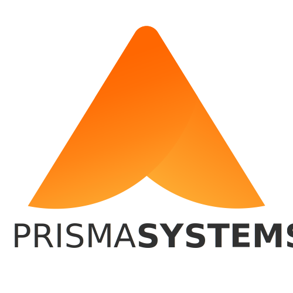

  

<!-- <h1 align="center">
  
</h1> -->

## 💻 Prisma Systems

O projeto é um site institucional da startup Prisma Systems para divulgar seus serviços e soluções tecnologicas.

## 🧪 Tecnologias

Esse projeto foi desenvolvido com as seguintes tecnologias:

- [React](https://reactjs.org)
- [TypeScript](https://www.typescriptlang.org/)

## 📚 Bibliotecas

Para auxiliar no desenvolvimento do projeto, utilizei as seguinte bibliotecas:

- [Framer](https://www.framer.com/docs/)
- [Material-UI](https://mui.com/pt/getting-started/installation/)
- [ReactToastify](https://fkhadra.github.io/react-toastify/introduction)
- [StyledComponents](https://styled-components.com)
